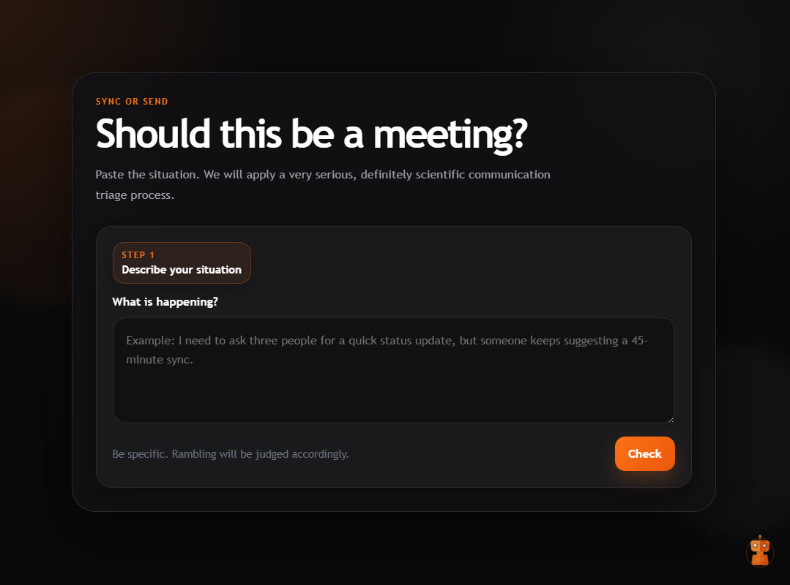

# Sync or Send

**Should this be a meeting?**

A lightweight web app that answers that question with more honesty than your calendar ever will.

👉 **Live demo:** https://sync.nathalievaiser.com/



---

## What It Is

`Sync or Send` looks like a normal productivity tool.

It is not.

Paste in a work scenario, click `Check`, and it will tell you whether this should be:
- `Email`
- `Teams or Slack`
- `Meeting`

Most of the time, it’s not a meeting.

If you want, you can generate a message to send back in one of four tones:

- `Polite`
- `Direct`
- `Passive Aggressive`
- `Brutal`

---

## Why It Exists

Too many meetings exist because:
- writing feels harder than talking  
- decisions aren’t made ahead of time  
- “alignment” becomes a default  

This app leans into that reality.

It behaves like a real SaaS tool, but the responses are intentionally:
- dry  
- judgmental  
- occasionally unnecessary  

---

## What It Does

- Accepts a freeform scenario
- Runs a short fake “analysis” phase
- Classifies the input using simple rules
- Returns a verdict + explanation
- Lets you reroll with `Try another`
- Generates copyable messages based on tone
- Works entirely as a static frontend (no backend, no APIs)

---

## How It Works

### Verdict logic

Scenarios are mapped using keyword detection and input length into categories like:

- `status update`
- `FYI / info`
- `simple question`
- `approval`
- `brainstorm`
- `decision`
- `too many people`
- `one-on-one`
- `urgent incident`
- `rambling`
- `generic`
- `legit meeting`

Most categories resolve deterministically.

Only the `generic` bucket uses weighted randomness (heavily biased toward async).

---

### Response system

- `responses.js` contains 180+ explanations across categories
- Verdict and explanation are always aligned
- Message generation is tone-based and templated

---

### UX flow

1. Enter a scenario  
2. Click `Check`  
3. Wait ~1.5s while it “analyzes”  
4. Get a verdict + explanation  
5. Optionally reroll (`Try another`)  
6. Generate a message  
7. Switch tone and copy  

---

## Tech Stack

- HTML  
- CSS  
- Vanilla JavaScript  

No framework. No build step.

---

## Project Structure

```text
.
├── index.html
├── styles.css
├── app.js
├── responses.js
└── README.md
